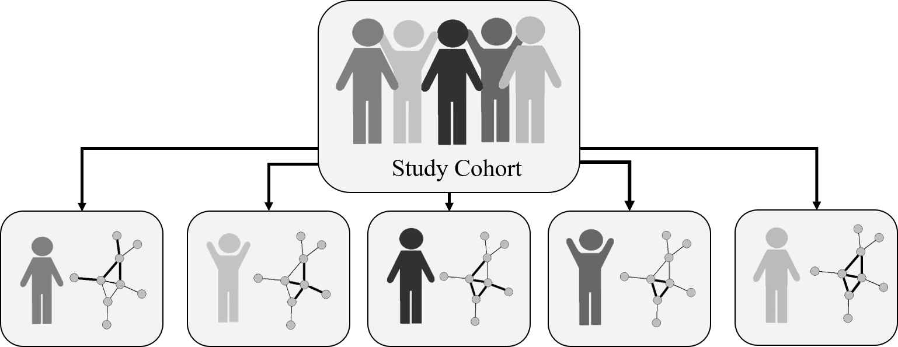

# Framework to study graph-theoretical features of individual-specific networks for prediction modelling

## Background

The simulation study examines the use of graph-theoretical features
extracted from individual-specific networks for prognostic prediction
modelling. In particular, the study focuses on individual-specific
network sparsification, which is mostly performed in applied data
analysis by selecting any fixed cutoff value. We propose a flexible
parameterization of the graph-theoretical features generated by a
sequential sparsification and investigate whether it provides an
improvement in terms of the prediction performance of the model.


<p align="center">
    
</p>


## Contents

This repository contains the main code, R functions and auxiliary
investigative files to conduct the simulation study and reproduce its
results.

## Installation

You can install the development version from GitHub:

``` r
# install.packages("devtools")
devtools::install_github("mgregorich/PRONET")
```

## Usage

## Prerequisites

The code uses the statistical software `R` (>= 4.0)

## Disclaimer

This repository is still in the development phase.
